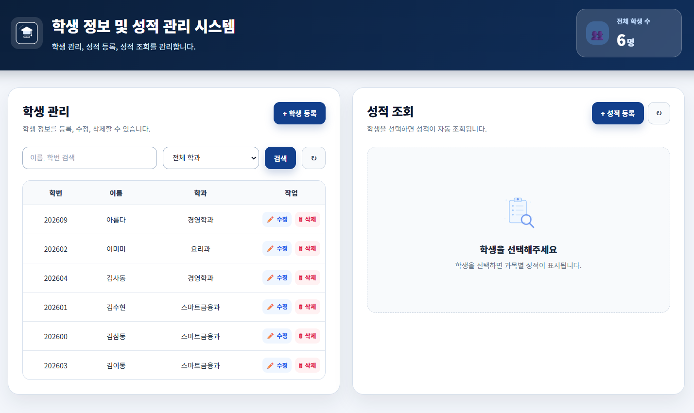
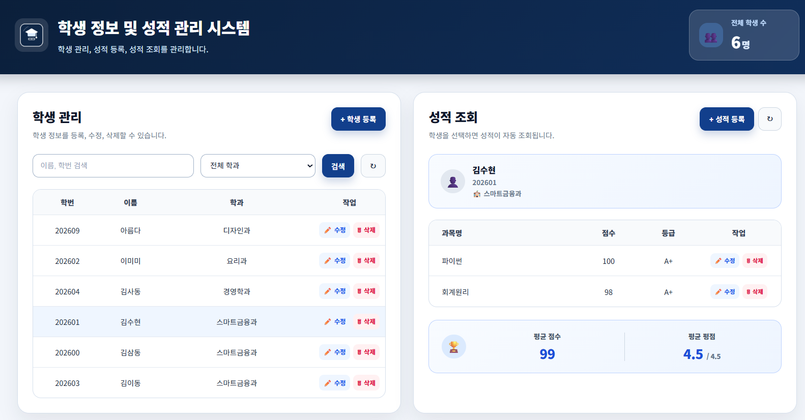
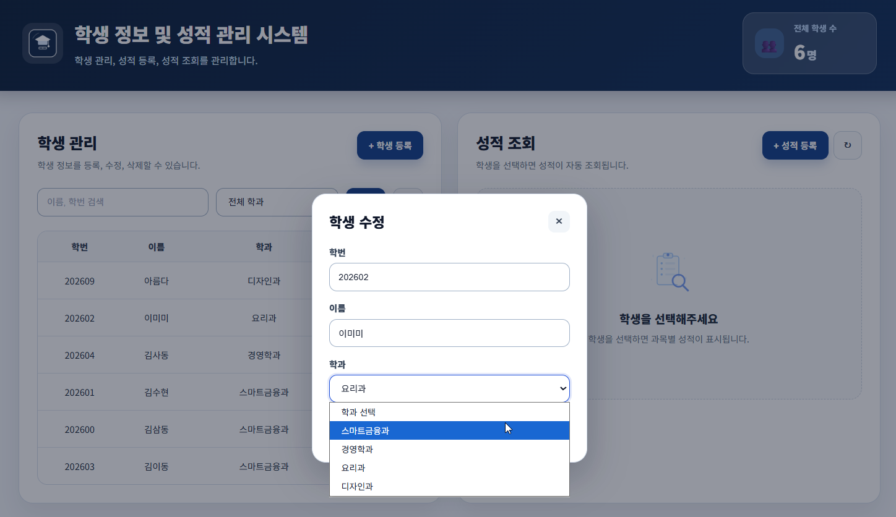
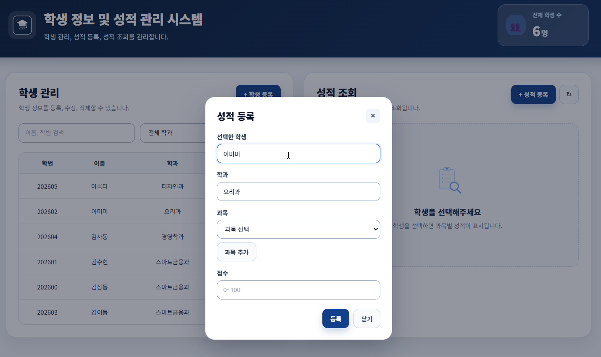
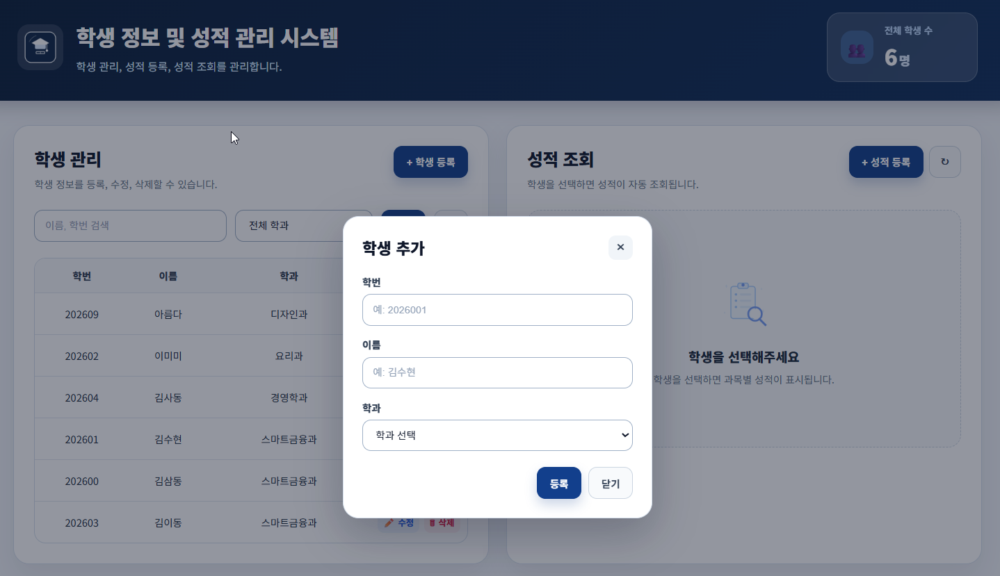
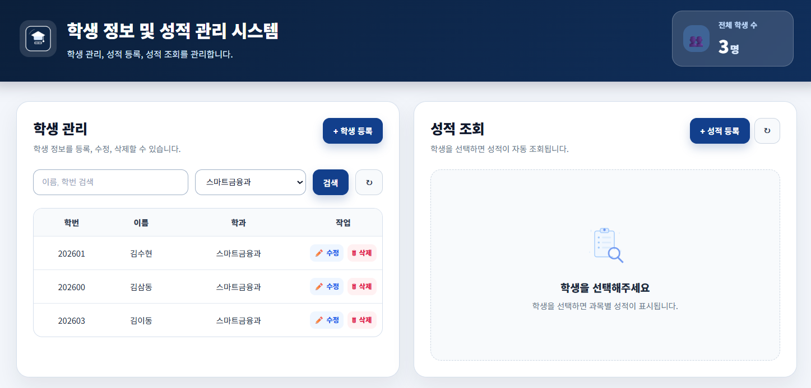
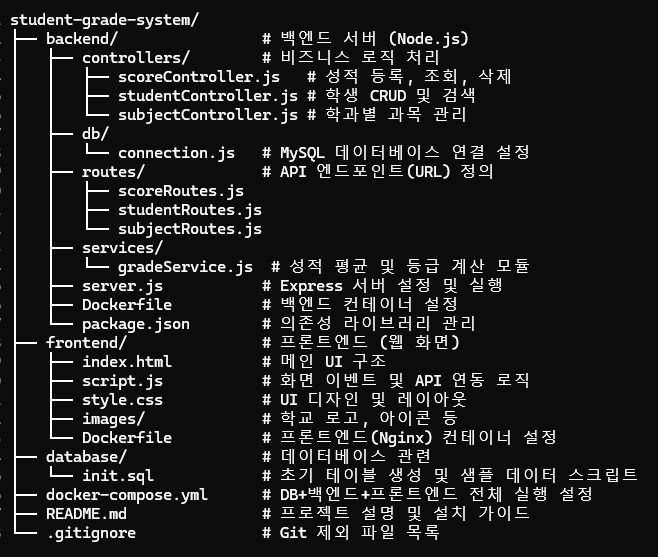

# 학생 정보 및 성적 관리 시스템

학생 기본 정보와 과목별 성적을 관리하는 Docker 기반 웹 애플리케이션입니다. 학생 등록, 수정, 삭제, 검색과 성적 등록 및 조회 기능을 제공합니다.

## 주요 기능

- 학생 정보 등록, 수정, 삭제
- 이름, 학번, 학과 기준 학생 검색
- 학생별 과목 성적 등록 및 삭제
- 평균 점수, 등급, 4.5 만점 기준 평점 자동 계산
- 학과별 과목 관리 및 과목 추가
- Docker Compose 기반 실행 환경

## 화면

### 메인 화면



### 성적 조회



### 학생 수정



### 성적 등록



### 학생 추가



### 학과 검색



### 프로젝트 구조



## 기술 스택

### Frontend

- HTML5
- CSS3
- JavaScript
- Nginx

### Backend

- Node.js
- Express
- MySQL 8.0

### Infrastructure

- Docker
- Docker Compose
- Docker Volume

## 실행 방법

Docker와 Docker Compose가 설치되어 있어야 합니다.

```bash
git clone https://github.com/Daisy7942/student-grade-system.git
cd student-grade-system
docker compose up --build -d
```

실행 후 아래 주소로 접속합니다.

- Frontend: http://localhost:8080
- Backend API: http://localhost:5000/api
- Database: localhost:3307

## 데이터베이스 구조

- `students`: 학생 기본 정보
- `subjects`: 과목 정보
- `scores`: 학생별 과목 성적
- `department_subjects`: 학과별 기본 과목 매핑

## 참고

- 기본 프론트엔드 포트는 `8080`입니다.
- 컨테이너를 내려도 Docker Volume에 데이터가 유지됩니다.
- 데이터를 완전히 초기화하려면 Docker Volume을 삭제해야 합니다.

---

2026 Student Grade System. All rights reserved.
