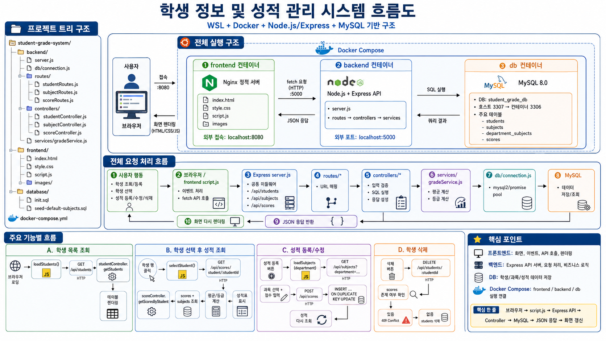

# 학생 정보 및 성적 관리 시스템

학생 기본 정보와 과목별 성적을 관리하는 Docker 기반 웹 애플리케이션입니다. 학생 등록, 검색, 수정, 삭제와 과목별 성적 등록 및 조회 기능을 제공합니다.

## 시스템 흐름도



브라우저에서 실행되는 프론트엔드가 Express API 서버로 요청을 보내고, 백엔드는 MySQL 데이터베이스에 학생, 과목, 성적 데이터를 저장하거나 조회한 뒤 JSON 응답을 반환합니다.

```text
Browser
 -> Frontend: Nginx + HTML/CSS/JavaScript
 -> Backend: Node.js + Express
 -> Database: MySQL 8.0
```

## 주요 기능

- 학생 정보 등록, 조회, 수정, 삭제
- 이름, 학번, 학과 기준 학생 검색
- 학생 선택 후 과목별 성적 조회
- 학생별 과목 성적 등록, 수정, 삭제
- 평균 점수, 문자 등급, 4.5 만점 기준 평점 자동 계산
- 학과별 기본 과목 조회 및 과목 추가
- Docker Compose 기반 통합 실행 환경

## 기술 스택

### Frontend

- HTML5
- CSS3
- JavaScript
- Nginx

### Backend

- Node.js
- Express
- mysql2

### Database

- MySQL 8.0
- Docker Volume

### Infrastructure

- Docker
- Docker Compose

## 프로젝트 구조

```text
student-grade-system/
├─ backend/
│  ├─ server.js
│  ├─ package.json
│  ├─ Dockerfile
│  ├─ db/
│  │  └─ connection.js
│  ├─ routes/
│  │  ├─ studentRoutes.js
│  │  ├─ subjectRoutes.js
│  │  └─ scoreRoutes.js
│  ├─ controllers/
│  │  ├─ studentController.js
│  │  ├─ subjectController.js
│  │  └─ scoreController.js
│  └─ services/
│     └─ gradeService.js
├─ frontend/
│  ├─ index.html
│  ├─ style.css
│  ├─ script.js
│  ├─ Dockerfile
│  └─ images/
├─ database/
│  ├─ init.sql
│  └─ seed-default-subjects.sql
├─ docker-compose.yml
├─ README.md
└─ .gitignore
```

## 실행 방법

Docker와 Docker Compose가 설치되어 있어야 합니다.

```bash
git clone https://github.com/Daisy7942/student-grade-system.git
cd student-grade-system
docker compose up --build -d
```

실행 후 아래 주소로 접속합니다.

- Frontend: http://localhost:8080
- Backend API: http://localhost:5000/api
- Database: localhost:3307

## API 구성

### 학생 API

- `GET /api/students`: 학생 목록 조회
- `POST /api/students`: 학생 등록
- `PUT /api/students/:studentId`: 학생 수정
- `DELETE /api/students/:studentId`: 학생 삭제

### 과목 API

- `GET /api/subjects`: 과목 목록 조회
- `GET /api/subjects?department=학과명`: 학과별 과목 조회
- `POST /api/subjects`: 과목 추가

### 성적 API

- `GET /api/scores`: 전체 성적 조회
- `GET /api/scores/student/:studentId`: 특정 학생 성적 조회
- `POST /api/scores`: 성적 등록 또는 수정
- `DELETE /api/scores/:scoreId`: 성적 삭제

## 데이터베이스 구조

- `students`: 학생 기본 정보
- `subjects`: 과목 정보
- `department_subjects`: 학과별 과목 매핑
- `scores`: 학생별 과목 성적

`scores` 테이블은 학생과 과목 조합을 유일하게 관리합니다. 같은 학생의 같은 과목 성적을 다시 저장하면 새로 추가하지 않고 기존 점수를 수정합니다.

## 화면 예시

### 메인 화면


### 성적 조회


### 학생 추가


### 학생 수정


### 성적 등록


### 학과 검색


## 참고

- 기본 프론트엔드 포트는 `8080`입니다.
- 백엔드 API 포트는 `5000`입니다.
- MySQL은 호스트 기준 `3307` 포트로 접근합니다.
- 컨테이너를 내려도 Docker Volume에 데이터가 유지됩니다.
- 데이터를 완전히 초기화하려면 Docker Volume을 삭제해야 합니다.

---

2026 Student Grade System. All rights reserved.
